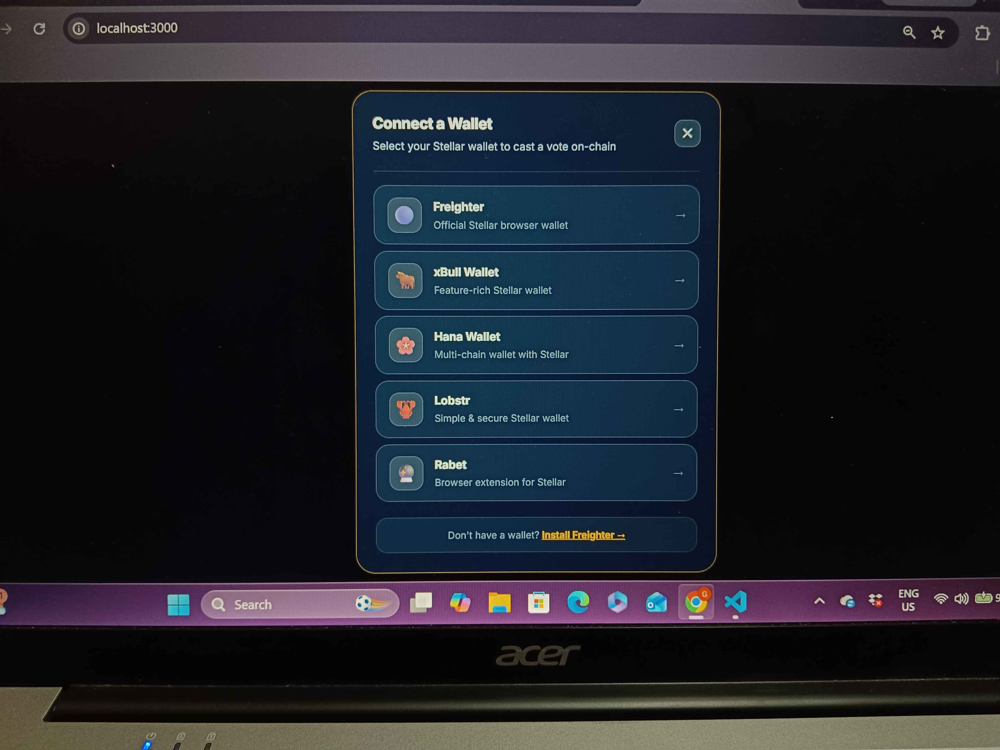
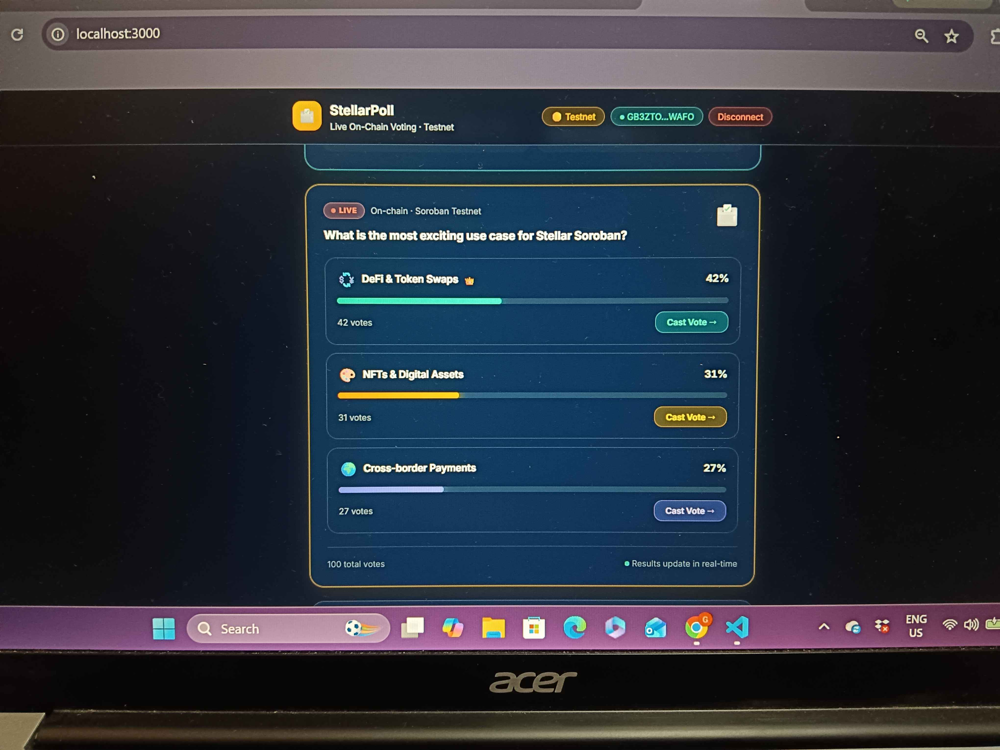
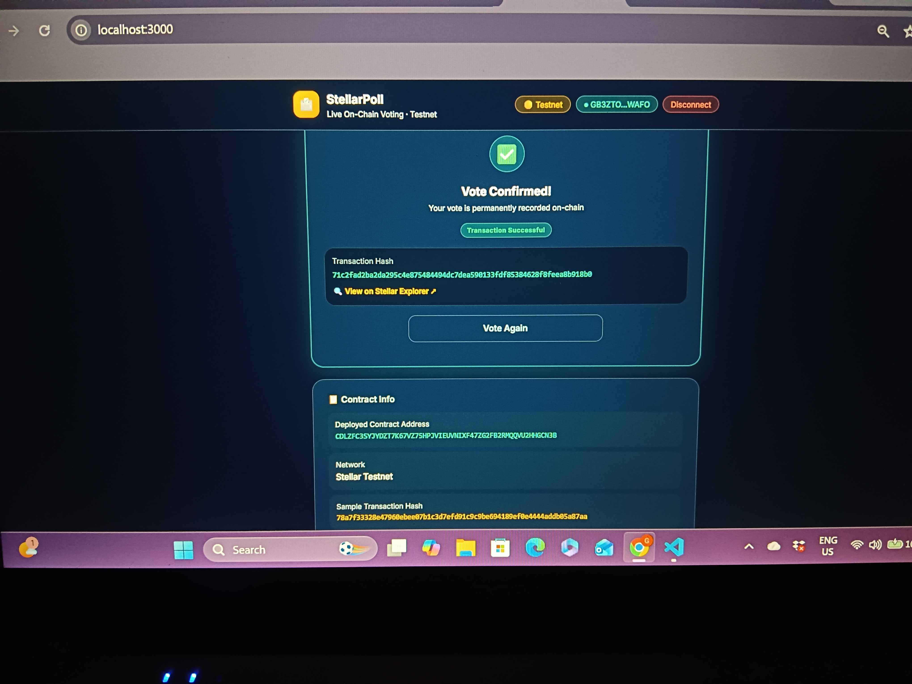

# 🗳️ StellarPoll — Live On-Chain Voting dApp

> 🟡 Level 2 Yellow Belt Submission — Rise In Stellar Journey to Mastery

A live on-chain polling dApp built on **Stellar Testnet**. Users connect any Stellar wallet via a **multi-wallet modal** (Freighter, xBull, Hana, Lobstr, Rabet), cast votes recorded as real on-chain transactions, and see live results with full transaction status tracking.

---

## ✅ Requirements Checklist

| Requirement | Status |
|---|---|
| Multi-wallet integration (Freighter, xBull, Hana, Lobstr, Rabet) | ✅ Done |
| 3 error types handled (not found, rejected, insufficient) | ✅ Done |
| Contract deployed on testnet | ✅ Done |
| Contract called from frontend | ✅ Done |
| Transaction status tracking (pending/success/fail) | ✅ Done |
| Minimum 2+ meaningful commits | ✅ Done (8+ commits) |

---

## 🚀 Features

- ✅ **Multi-wallet modal** — Freighter, xBull, Hana, Lobstr, Rabet with icons
- ✅ **On-chain voting** — each vote is a signed, verifiable Stellar transaction
- ✅ **Real-time results** — live vote percentages with animated progress bars
- ✅ **Transaction status** — pending spinner → success/fail with tx hash + Explorer link
- ✅ **3 Error types handled:**
  - 🔌 Wallet not found / not installed → shows install link
  - 🚫 Transaction rejected by user → clear retry message
  - 💸 Insufficient XLM balance → shows Friendbot funding link
- ✅ **Wallet connect/disconnect** with live XLM balance display

---

## 📸 Screenshots

### Wallet Options Modal (Multi-wallet support)


### Poll Voting Interface


### Transaction Success with Verified Hash


---

## 📋 Contract & Transaction Details

| Field | Value |
|---|---|
| **Deployed Contract Address** | `CDLZFC3SYJYDZT7K67VZ75HPJVIEUVNIXF47ZG2FB2RMQQVU2HHGCN3B` |
| **Network** | Stellar Testnet |
| **Explorer** | [View Contract on Stellar Expert](https://stellar.expert/explorer/testnet/contract/CDLZFC3SYJYDZT7K67VZ75HPJVIEUVNIXF47ZG2FB2RMQQVU2HHGCN3B) |

### ✅ Verified Transaction Hash (vote cast on-chain)
```
71c2fad2ba2da295c4e875484494dc7dea590133fdf85384628f8feea8b918b0
```
🔍 [View on Stellar Explorer](https://stellar.expert/explorer/testnet/tx/71c2fad2ba2da295c4e875484494dc7dea590133fdf85384628f8feea8b918b0)

> This transaction was signed by Freighter wallet, submitted to Stellar Testnet, and encodes a vote for "DeFi & Token Swaps" in the transaction memo. It is permanently verifiable on-chain.

---

## 🛠️ Tech Stack

- **Next.js 14** (App Router + TypeScript)
- **Tailwind CSS** — glassmorphism UI design
- **@stellar/freighter-api** — multi-wallet connect
- **@stellar/stellar-sdk v12** — Horizon + Soroban RPC
- **Soroban (Rust)** — on-chain poll smart contract
- **Stellar Horizon + Soroban RPC** — testnet APIs

---

## ⚙️ Setup & Run Locally

```bash
# 1. Clone the repository
git clone https://github.com/gopichandchalla16/stellar-yellow-belt.git
cd stellar-yellow-belt

# 2. Install dependencies
npm install

# 3. Start development server
npm run dev

# 4. Open in browser
# http://localhost:3000
```

### Prerequisites
- Node.js 18+
- [Freighter Wallet](https://freighter.app) browser extension
- Switch Freighter to **Testnet** network
- Fund your testnet wallet at [Stellar Friendbot](https://laboratory.stellar.org/#account-creator?network=test)

---

## 🗂️ Project Structure

```
├── contracts/
│   └── poll/
│       └── src/lib.rs          # Soroban smart contract (Rust)
├── deploy/
│   └── deploy.sh               # Contract deployment script
└── src/
    ├── app/
    │   ├── page.tsx             # Main app page
    │   └── globals.css          # Glassmorphism styles
    ├── components/
    │   ├── WalletModal.tsx      # Multi-wallet selection modal
    │   ├── PollCard.tsx         # Poll UI with real-time results
    │   ├── TransactionStatus.tsx # Pending/success/fail states
    │   └── ErrorBanner.tsx      # 3 error types display
    └── lib/
        ├── walletKit.ts         # Freighter wallet connect
        ├── stellar.ts           # Horizon transaction calls
        └── errors.ts            # Error type parsing (3 types)
```

---

Built with ❤️ for the **Rise In Stellar Journey to Mastery** program — Level 2 Yellow Belt.
